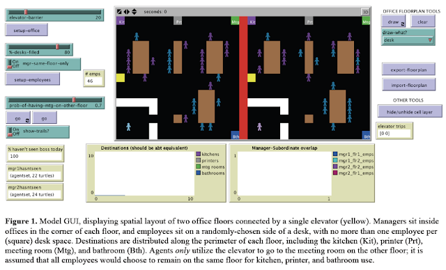

# Manager-Subordinate Proximity: A Spatial Agent-Based Model

Preliminary effort to explore how workplace layout impacts on subordinates interactions with managers. We developed a spatial agent-based model to simulate how the physical seating locations of individuals with reporting relationships might enhance or detract from an effective manager-subordinate relationship. Below you can read the abstract of our paper and find out more information about the model.

**For the NetLogo 6.1.0 model see:** [Manager_Subordinate_Proximity.nlogo](Manager_Subordinate_Proximity.nlogo) 

## Abstract:

Employees may be co-located with their manager or they may be separated by distances ranging from a short walk to across oceans, with many gradations in between. Some distances, such as those between floors of an office building, are physically short but may be psychologically quite far. The current project developed a spatial ABM to examine the likelihood of unplanned manager-subordinate encounters in an office setting with two floors. Early results suggest that subordinates located on a different floor than their manager are substantially less likely to have even a single spontaneous encounter with their manager in a work day, despite a relatively short physical separation. If leader-follower (i.e., manager-subordinate) relationships are influenced by spontaneous face-to-face encounters, this finding represents a challenge for organizations with managers having subordinates who are close, but not close enough. Additionally, attempting to impose top-down requirements to travel between floors (e.g., when scheduling meetings) may do surprisingly little to abate this problem. Implications of these findings for organizations are discussed, as are limitations and future research, including possibilities for future model verification and validation.

**Keywords**: workplace design, supervision, leadership, management, employee performance, virtual teams, leader distance, collaboration, agent-based modeling, ABM.

 
 
 
## Reference
 
* **Briggs, T. and Crooks, A.T.** (2016), Close, But Not Close Enough: A Spatial Agent-Based Model of Manager-Subordinate Proximity. *The Computational Social Science Society of Americas Conference*, Santa Fe, NM.  [(PDF)](https://www.dropbox.com/s/5a5csg4k9iz81y7/CloseButNotCloseEnough.pdf?dl=0)

